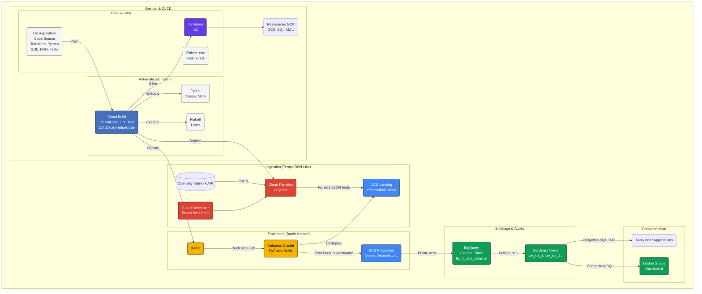

# ✈️ Analyse de Données de Vol ADS-B sur GCP (Région Toulousaine) 🇫🇷

**Un projet Data Engineering End-to-End démontrant la construction d'un pipeline de données robuste, scalable et automatisé sur Google Cloud Platform pour l'analyse du trafic aérien.**

---

## 🎯 Objectif du Projet

Ce projet vise à ingérer, traiter, stocker, orchestrer et visualiser les données publiques de suivi de vols ADS-B (Automatic Dependent Surveillance–Broadcast) fournies par OpenSky Network, en se concentrant potentiellement sur la région de Toulouse, hub aéronautique majeur.

L'objectif n'est pas seulement technique, mais aussi de démontrer comment un pipeline data moderne sur GCP peut transformer des données brutes en insights actionnables, **réduisant ainsi le temps d'analyse** pour les parties prenantes (opérations aéroportuaires, études environnementales, planification stratégique) et fournissant une **source de données fiable et à jour** sur l'activité aérienne locale.

Ce repository sert de portfolio pour illustrer mes compétences en Data Engineering sur l'écosystème GCP.

## ✨ Fonctionnalités et Points Clés

* **Pipeline de Données E2E :** De l'ingestion brute à la préparation pour la visualisation, en passant par le traitement, le stockage et l'orchestration.
* **Architecture GCP Moderne :** Utilisation de services managés et serverless pour la scalabilité et l'efficacité opérationnelle (Cloud Functions Gen2, Cloud Storage, BigQuery, Dataproc, Cloud Composer v2, Cloud Build).
* **Traitement de Données Scalable :** Utilisation d'Apache Spark (via PySpark sur Dataproc) pour traiter et transformer les données JSON brutes.
* **Stockage Optimisé :** Écriture des données traitées au format Parquet avec **partitionnement de type Hive** (année, mois, jour, heure) sur GCS pour des requêtes analytiques performantes. Utilisation de l'**écrasement de partition dynamique**.
* **Data Warehousing Analytique :** Exposition des données traitées dans BigQuery via une **table externe partitionnée** pour des requêtes SQL efficaces, complétée par des **vues SQL** pré-calculant des KPIs et facilitant l'analyse.
* **Orchestration Automatisée :** Utilisation de Cloud Composer v2 (Apache Airflow managé) pour planifier, exécuter et surveiller le pipeline de traitement Spark (DAG Python).
* **Infrastructure as Code (IaC) :** Définition et gestion de l'infrastructure GCP (Buckets, Dataset BQ, IAM...) via **Terraform** pour la reproductibilité et la gestion versionnée.
* **Tests Automatisés :** Implémentation de tests unitaires pour la logique de transformation PySpark (avec **pytest** et **chispa**) et pour la fonction d'ingestion (avec **pytest** et **unittest.mock**).
* **Intégration Continue (CI) :** Mise en place d'un pipeline **Cloud Build** déclenché par Git pour automatiser la validation de l'infrastructure (Terraform Validate), le linting du code Python (`flake8`) et l'exécution des tests unitaires (`pytest`).
* **Configuration Sécurisée :** Utilisation d'un fichier `.env` (ignoré par Git) pour gérer les configurations spécifiques à l'environnement d'exécution local (backfill).
* **Préparation pour Visualisation :** Données et vues prêtes à être consommées par un outil de BI comme Looker Studio.

## 🏗️ Architecture

Le diagramme ci-dessous illustre le flux de données et les composants principaux du projet :

**Flux Détaillé :**
1.  **Ingestion :** Cloud Scheduler déclenche (toutes les 10 min) une Cloud Function (Python). Celle-ci interroge l'API OpenSky Network et écrit les données JSON brutes dans GCS Landing Zone (`YYYY/MM/DD/HH/`).
2.  **Orchestration :** Cloud Composer v2 exécute un DAG Airflow (planifié `@hourly`).
3.  **Traitement :** Le DAG soumet un job PySpark à un cluster Dataproc. Le job lit les JSON bruts de l'heure précédente depuis GCS Landing. Il nettoie, transforme les données, et les enrichit avec des colonnes de partition (year, month, day, hour). Il écrit le résultat au format Parquet dans GCS Processed Zone en utilisant le **partitionnement Hive** et l'**écrasement dynamique des partitions**.
4.  **Accès Analytique :** Une **table externe partitionnée** dans BigQuery (`flight_data_external`) pointe vers les fichiers Parquet sur GCS, permettant des requêtes SQL performantes grâce à l'élimination des partitions (partition pruning). Des **vues SQL** (`vw_*`) sont définies dans un dossier `bigquery/views/` et créées sur BigQuery pour simplifier l'accès aux KPIs.
5.  **Consommation :** Les analystes peuvent interroger les vues/tables BigQuery via SQL, ou connecter des outils de BI comme Looker Studio pour créer des dashboards interactifs.
6.  **Gestion :** L'infrastructure est définie avec Terraform (`IaC`). Le code (Python, SQL, DAG, Terraform) est versionné avec Git. La configuration sensible locale est gérée via un fichier `.env` (ignoré par Git).
7.  **Intégration Continue (CI) :** Cloud Build est déclenché par les `push` Git. Il valide le code Terraform, installe les dépendances Python (y compris `pyspark`, `pytest`, `chispa`, `flake8`), exécute le linter `flake8` et les tests unitaires `pytest` pour la Cloud Function et le script Spark. *(Note: L'exécution des tests Spark dans Cloud Build peut nécessiter une attention particulière concernant l'environnement Java).*

## 🛠️ Technologies Utilisées

* **Cloud Platform :** Google Cloud Platform (GCP)
* **Services GCP Principaux :**
    * Cloud Functions (**Gen 2**)
    * Cloud Storage (GCS)
    * Dataproc
    * BigQuery
    * Cloud Composer (**v2**, Airflow 2.x)
    * Cloud Scheduler
    * Cloud Build
    * IAM
    * Looker Studio
    * *(Optionnel: Secret Manager, Artifact Registry)*
* **Langages :** Python (3.11), SQL (GoogleSQL), Bash
* **Frameworks / Bibliothèques Clés :**
    * PySpark (pour le traitement)
    * Apache Airflow (pour l'orchestration)
    * Pandas, Requests (dans Cloud Function)
    * google-cloud-python libraries
    * `pytest`, `chispa`, `unittest.mock`, `freezegun` (pour les tests)
    * `flake8` (pour le linting)
* **Infrastructure & CI/CD :** Terraform, Git, Docker (implicitement)
* **Concepts Clés :** Partitionnement Hive, Tables Externes BigQuery, IaC, CI, Tests Unitaires, Mocking, Orchestration DAG.
* **Formats de Données :** JSON (brut), Parquet (traité)

## 📊 Données Source

Les données proviennent de l'[API REST de OpenSky Network](https://openskynetwork.github.io/opensky-api/rest.html). Elles consistent en des "vecteurs d'état" (state vectors) d'aéronefs transmis via ADS-B et d'autres systèmes, contenant des informations telles que :
* Identifiant `icao24`
* Indicatif d'appel (`callsign`)
* Position (`longitude`, `latitude`)
* Altitude (`baro_altitude`, `geo_altitude`)
* Vitesse (`velocity`)
* Cap (`true_track`)
* Taux de montée/descente (`vertical_rate`)
* Statut au sol (`on_ground`)
* Timestamps (`time_position`, `last_contact`)
* Code transpondeur (`squawk`)
* Pays d'origine (`origin_country`)

L'API publique est utilisée, avec un filtrage géographique appliqué lors de l'ingestion pour se concentrer sur la région d'intérêt.

## ⚙️ Installation et Exécution (Instructions Haut Niveau)

Ce projet nécessite une configuration spécifique sur GCP.

**Prérequis :**
* Compte Google Cloud avec facturation activée (**Attention aux coûts** de Composer et Dataproc si actifs).
* `gcloud` CLI installé et configuré.
* `terraform` CLI installé.
* `git` installé.
* Python 3.11 (ou compatible) et `pip` pour l'environnement virtuel local.
* Java JDK (ex: 11) installé localement avec `JAVA_HOME` configuré.

**Étapes :**
1.  **Cloner le Dépôt :** `git clone https://github.com/remigarcia31/toulouse-aero-analysis.git`
2.  **Environnement Local :**
    * `cd toulouse-aero-analysis`
    * `python -m venv venv`
    * `source venv/bin/activate`
    * `pip install -r src/cloud_function_ingest/requirements.txt -r src/spark_job/requirements.txt -r requirements-dev.txt`
3.  **Configuration :**
    * Créez un fichier `.env` à la racine (copiez depuis `.env.example`).
    * Assurez-vous que `.env` est dans `.gitignore`.
    * Remplissez les variables (`PROJECT_ID`, noms de buckets...).
4.  **Infrastructure :** `cd terraform/`, `terraform init`, `terraform apply`. (Crée GCS, BQ Dataset, IAM...).
5.  **Déploiement Initial / CI :**
    * Le pipeline Cloud Build configuré dans `cloudbuild.yaml` devrait se déclencher sur `git push`. Il exécute `terraform validate`, `flake8`, `pytest` pour les différents composants.
    * Le déploiement effectif des Cloud Functions, DAGs, etc., n'est pas encore inclus dans la CI/CD (voir Améliorations). Un déploiement manuel initial (`gcloud functions deploy...`, `gsutil cp ...`) est nécessaire ou à intégrer à la CI/CD.
6.  **Orchestration & Scheduler (Si besoin de les activer) :**
    * Créez/Démarrez l'environnement Cloud Composer (`gcloud composer ...`).
    * Créez/Reprenez le job Cloud Scheduler (`gcloud scheduler ...`).
7.  **Backfill Historique (Optionnel - Manuel) :**
    * Démarrez un cluster Dataproc (`gcloud dataproc clusters create ...`).
    * Utilisez le script `backfill_spark_jobs.sh` (configuré via `.env`).
    * **SUPPRIMEZ** le cluster Dataproc après usage.
8.  **Lancement du Pipeline Orchestré :**
    * Nécessite un environnement Composer actif.
    * Le DAG actuel (`aero_data_processing_pipeline`) cible un cluster Dataproc manuel (`aero-cluster-test`). Pour un fonctionnement autonome, il faut le modifier pour utiliser des **clusters éphémères** (voir Améliorations).
    * Activez le DAG et le Scheduler pour un fonctionnement continu.

## 📊 Résultats & Visualisation

Les données traitées sont accessibles via les vues (`vw_*`) dans `toulouse-aero-analysis.aeronautics_data` dans BigQuery.

Un tableau de bord Looker Studio a été créé pour explorer interactivement ces données. Il inclut :
* Une carte de la position des avions.
* L'évolution du nombre d'avions uniques par heure.
* La répartition du trafic par pays d'origine.
* Des indicateurs sur l'altitude et la vitesse moyennes.
* Des filtres par date et par pays.

**[TODO : Insérez ici une capture d'écran de votre dashboard Looker Studio]**
``

**[TODO : Optionnel : ajoutez un lien si votre dashboard est public]**
`[Voir le Dashboard Interactif](LIEN_LOOKER_STUDIO_PUBLIC)`

## 🚀 Améliorations Possibles

* **CI/CD Complète :** Ajouter les étapes de **Déploiement Continu (CD)** dans Cloud Build pour déployer automatiquement Terraform, Cloud Function, DAG Airflow, scripts Spark.
* **Clusters Dataproc Éphémères :** **(Recommandé)** Modifier le DAG Airflow pour utiliser `DataprocCreateClusterOperator` et `DataprocDeleteClusterOperator` afin de créer/supprimer des clusters à la demande, optimisant les coûts.
* **Monitoring & Alerting :** Configurer des alertes Cloud Monitoring / Airflow Callbacks en cas d'échec.
* **Data Quality Checks :** Intégrer des tests de qualité de données (ex: via des opérateurs BigQuery dans Airflow, ou des outils comme dbt/Great Expectations).
* **Enrichissement des Données :** Joindre avec des bases de données externes (type d'avion, compagnie...).
* **Streaming Réel :** Remplacer l'ingestion par Pub/Sub et Dataflow.
* **Tests :** Ajouter des tests d'intégration pour valider le flux complet.
* **Sécurité :** Affiner les permissions IAM au minimum requis.
* **Gestion de la Configuration :** Utiliser des variables Airflow ou Secret Manager pour la configuration utilisée par les DAGs.
* **Gestion du Backfill via Airflow :** Implémenter une logique de backfill plus robuste directement dans Airflow.

## 👤 Auteur

* **Rémi GARCIA**
* **LinkedIn :** `https://www.linkedin.com/in/remi-garcia-31t12r/`
* **GitHub :** `https://github.com/remigarcia31`

---
