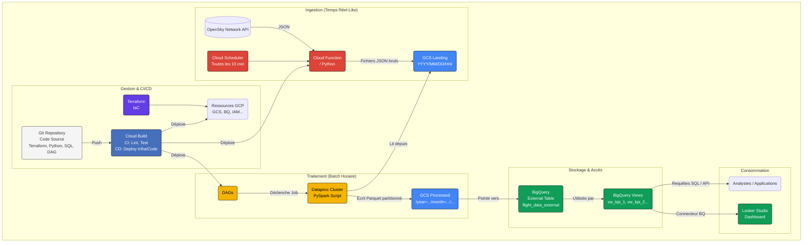

# ✈️ Analyse de Données de Vol ADS-B sur GCP (Région Toulousaine) 🇫🇷

**Un projet Data Engineering End-to-End démontrant la construction d'un pipeline de données robuste, scalable et automatisé sur Google Cloud Platform pour l'analyse du trafic aérien.**

---

## 🎯 Objectif du Projet

Ce projet vise à ingérer, traiter, stocker, orchestrer et visualiser les données publiques de suivi de vols ADS-B (Automatic Dependent Surveillance–Broadcast) fournies par OpenSky Network, en se concentrant potentiellement sur la région de Toulouse, hub aéronautique majeur.

L'objectif n'est pas seulement technique, mais aussi de démontrer comment un pipeline data moderne sur GCP peut transformer des données brutes en insights actionnables, **réduisant ainsi le temps d'analyse** pour les parties prenantes (opérations aéroportuaires, études environnementales, etc.) et fournissant une **source de données fiable et à jour** sur l'activité aérienne locale.

Ce repository sert de portfolio pour illustrer mes compétences en Data Engineering sur l'écosystème GCP.

## ✨ Fonctionnalités et Points Clés

* **Pipeline de Données E2E :** De l'ingestion brute à la visualisation, en passant par le traitement et le stockage.
* **Architecture GCP Moderne :** Utilisation de services managés et serverless pour la scalabilité et l'efficacité opérationnelle (Cloud Functions, Cloud Storage, BigQuery, Dataproc, Cloud Composer, Cloud Build).
* **Traitement de Données Scalable :** Utilisation d'Apache Spark (via PySpark sur Dataproc) pour traiter et transformer les données JSON brutes en format Parquet optimisé et partitionné (style Hive).
* **Data Warehousing Analytique :** Exposition des données traitées dans BigQuery via une table externe pour des requêtes SQL performantes, avec des vues pré-calculant des KPIs.
* **Orchestration Automatisée :** Utilisation de Cloud Composer (Apache Airflow) pour planifier et gérer l'exécution du pipeline de traitement Spark.
* **Infrastructure as Code (IaC) :** Définition de l'infrastructure GCP (Buckets, Dataset BQ, IAM...) via Terraform pour la reproductibilité et la gestion versionnée.
* **CI/CD (Fondations) :** Mise en place de Cloud Build pour l'intégration continue (linting, tests unitaires) du code applicatif et la validation de l'infrastructure.
* **Visualisation :** Préparation des données pour une restitution via un dashboard interactif (Looker Studio). *(Note: Le dashboard lui-même n'est pas dans ce repo, mais la préparation des données l'est).*

## 🏗️ Architecture

Le diagramme ci-dessous illustre le flux de données et les composants principaux du projet :

**Flux :**
1.  Cloud Scheduler déclenche une Cloud Function toutes les 10 minutes.
2.  La Cloud Function appelle l'API OpenSky Network, récupère les états des vols pour la zone définie, et écrit les données JSON brutes dans un bucket GCS (Landing Zone), partitionné par date et heure d'ingestion.
3.  Cloud Composer exécute un DAG Airflow (ex: toutes les heures).
4.  Le DAG soumet un job PySpark à un cluster Dataproc.
5.  Le job Spark lit les données JSON brutes de l'heure précédente depuis la Landing Zone GCS.
6.  Spark nettoie, transforme, structure les données (extrait les champs, convertit les types) et ajoute des colonnes de partition (année, mois, jour, heure).
7.  Spark écrit le résultat au format Parquet dans un second bucket GCS (Processed Zone), en utilisant le partitionnement Hive.
8.  Une table externe dans BigQuery est définie pour pointer vers les données Parquet partitionnées sur GCS.
9.  Des vues BigQuery sont créées par-dessus la table externe pour simplifier les requêtes et pré-calculer des KPIs.
10. Les données sont accessibles via SQL dans BigQuery ou via des outils de BI comme Looker Studio connectés aux vues/tables.
11. L'infrastructure est gérée par Terraform (IaC).
12. Cloud Build assure l'intégration continue (linting, tests) et potentiellement le déploiement continu (non implémenté complètement dans cette phase).

## 🛠️ Technologies Utilisées

* **Cloud Platform :** Google Cloud Platform (GCP)
* **Services GCP Principaux :**
    * Cloud Functions
    * Cloud Storage (GCS)
    * Dataproc (pour Spark)
    * BigQuery (Data Warehouse + SQL Engine)
    * Cloud Composer (v2 - Apache Airflow managé)
    * Cloud Scheduler
    * Cloud Build (CI/CD)
    * IAM (Identity and Access Management)
    * Looker Studio (Visualisation)
    * *(Optionnel: Secret Manager, Artifact Registry)*
* **Langages :** Python 3.11, SQL (GoogleSQL), Bash
* **Frameworks / Bibliothèques :** PySpark, Apache Airflow, Pandas (potentiellement), Requests, google-cloud-python libraries, Flask (via Functions Framework)
* **Infrastructure & CI/CD :** Terraform, Git, Docker (implicitement via Cloud Build/Functions)
* **Formats de Données :** JSON (brut), Parquet (traité)

## 📊 Données Source

Les données proviennent de l'[API REST de OpenSky Network](https://openskynetwork.github.io/opensky-api/rest.html). Elles consistent en des "vecteurs d'état" (state vectors) d'aéronefs transmis via ADS-B et d'autres systèmes, contenant des informations telles que :
* Identifiant `icao24`
* Indicatif d'appel (`callsign`)
* Position (`longitude`, `latitude`)
* Altitude (`baro_altitude`, `geo_altitude`)
* Vitesse (`velocity`)
* Cap (`true_track`)
* Taux de montée/descente (`vertical_rate`)
* Statut au sol (`on_ground`)
* Timestamps (`time_position`, `last_contact`)
* Code transpondeur (`squawk`)
* Pays d'origine (`origin_country`)

L'API publique est utilisée, avec un filtrage géographique appliqué lors de l'ingestion pour se concentrer sur la région d'intérêt.

## ⚙️ Installation et Exécution (Instructions Haut Niveau)

Ce projet nécessite une configuration spécifiquesur GCP.

**Prérequis :**
* Compte Google Cloud avec facturation activée (attention aux coûts de Composer et Dataproc si actifs).
* `gcloud` CLI installé et configuré (`gcloud auth login`, `gcloud auth application-default login`, `gcloud config set project ...`).
* `terraform` CLI installé.
* `git` installé.
* Python 3.11 (ou compatible) et `pip` pour l'environnement virtuel local.
* Java JDK (ex: 11) installé localement avec `JAVA_HOME` configuré (pour les tests Spark locaux).

**Étapes :**
1.  **Cloner le Dépôt :** `git clone https://github.com/remigarcia31/toulouse-aero-analysis.git`
2.  **Environnement Local :** `cd toulouse-aero-analysis` puis `python -m venv venv` et `source venv/bin/activate`. Installez les dépendances : `pip install -r src/cloud_function_ingest/requirements.txt -r requirements.txt`.
**TODO : FAIRE UN .env.example**
3.  **Configuration :** Créez un fichier `.env` à la racine en vous basant sur un éventuel `.env.example` (assurez-vous que `.env` est dans `.gitignore`). Remplissez les variables (ID projet, noms de buckets...).
4.  **Infrastructure :** Naviguez dans `terraform/`, lancez `terraform init` puis `terraform apply`. Cela créera les buckets GCS, le dataset BigQuery, les comptes de service et les permissions IAM.
5.  **Composants Applicatifs (Exemple Déploiement Initial):**
    * **Cloud Function :** Déployez via `gcloud functions deploy ...` (voir les commandes dans les étapes précédentes du guide).
    * **Script Spark :** Uploadez sur GCS (`gsutil cp src/spark_job/... gs://...`).
    * **DAG Airflow :** Uploadez sur le bucket GCS de Composer (`gsutil cp dags/... gs://...`).
    * *(Note: Idéalement, ces déploiements seraient gérés par l'étape CD de Cloud Build).*
6.  **Orchestration & Scheduler :**
    * Créez l'environnement Cloud Composer (via `gcloud composer environments create ...` - **Attention aux coûts !**).
    * Créez le job Cloud Scheduler (via `gcloud scheduler jobs create ...`) pour déclencher la fonction d'ingestion. Mettez-le en pause initialement si vous faites un backfill manuel.
7.  **Backfill Historique (Optionnel - Manuel) :**
    * Créez un cluster Dataproc temporaire (`gcloud dataproc clusters create ...`).
    * Utilisez le script `backfill_spark_jobs.sh` (après l'avoir configuré via `.env`) pour soumettre les jobs Spark pour chaque heure historique.
    * **SUPPRIMEZ** le cluster Dataproc après le backfill (`gcloud dataproc clusters delete ...`).
8.  **Lancement du Pipeline Orchestré :**
    * Assurez-vous que le cluster Dataproc manuel (`aero-cluster-test`) est supprimé (le DAG le référence encore, il faudra le modifier pour utiliser des clusters éphémères).
    * Activez ("Unpause") le DAG `aero_data_processing_pipeline` dans l'UI Airflow.
    * Activez ("Resume") le job Cloud Scheduler (`trigger-opensky-ingest-workaround`).
    * Le pipeline devrait maintenant tourner de manière autonome (Scheduler -> Function -> GCS Landing -> Composer/Airflow -> Dataproc -> GCS Processed -> BQ External Table).

## 📊 Résultats & Visualisation

Les données traitées et partitionnées sont disponibles pour analyse via SQL dans BigQuery en utilisant la table `toulouse-aero-analysis.aeronautics_data.flight_data_external` ou les vues `vw_*` associées.

Un tableau de bord Looker Studio a été créé pour explorer interactivement ces données. Il inclut :
* Une carte de la position des avions.
* L'évolution du nombre d'avions uniques par heure.
* La répartition du trafic par pays d'origine.
* Des indicateurs sur l'altitude et la vitesse moyennes.
* Des filtres par date et par pays.

** TODO : Insérez ici une capture d'écran dashboard Looker Studio)**
``

** TODO : Optionnel : ajoutez un lien dashboard public)**
`[Voir le Dashboard Interactif](LIEN_LOOKER_STUDIO_PUBLIC)`

## 🚀 Améliorations Possibles

* **CI/CD Complète :** Automatiser le déploiement de toutes les ressources (Terraform apply, Cloud Function, DAG, script Spark) via Cloud Build.
* **Clusters Dataproc Éphémères :** Modifier le DAG Airflow pour créer un cluster Dataproc à la demande pour chaque job Spark et le supprimer ensuite (`DataprocCreateClusterOperator`, `DataprocDeleteClusterOperator`). C'est plus économique.
* **Monitoring & Alerting :** Mettre en place des alertes Cloud Monitoring sur les échecs de DAG, les erreurs de fonction, ou des métriques métier (ex: volume de données anormal). Intégrer les `sla_miss_callback` d'Airflow.
* **Data Quality Checks :** Ajouter une étape dans le DAG (après Spark) pour valider la qualité des données écrites (ex: via BigQueryOperator lançant des requêtes SQL de validation, ou intégration d'outils comme Great Expectations ou dbt).
* **Enrichissement des Données :** Joindre les données ADS-B avec des bases de données externes (via `icao24`) pour obtenir le type d'avion, la compagnie aérienne, l'âge de l'appareil, etc. et permettre des analyses plus riches.
* **Streaming Réel :** Remplacer l'ingestion par batch (Cloud Function toutes les 10 min) par un pipeline streaming avec Pub/Sub et Dataflow pour une latence plus faible.
* **Tests :** Étoffer les tests unitaires et ajouter des tests d'intégration.
* **Sécurité :** Affiner les permissions IAM au plus juste besoin pour chaque compte de service.

## 👤 Auteur

* **Rémi GARCIA**
* **LinkedIn :** `https://www.linkedin.com/in/remi-garcia-31t12r/`
* **GitHub :** `https://github.com/remigarcia31`
