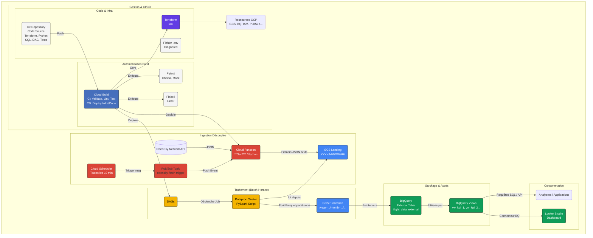

# ✈️ Analyse de Données de Vol ADS-B sur GCP (Région Toulousaine) 🇫🇷

**Un projet Data Engineering End-to-End démontrant la construction d'un pipeline de données robuste, scalable et automatisé sur Google Cloud Platform pour l'analyse du trafic aérien.**

---

## 🎯 Objectif du Projet

Ce projet vise à ingérer, traiter, stocker, orchestrer et visualiser les données publiques de suivi de vols ADS-B (Automatic Dependent Surveillance–Broadcast) fournies par OpenSky Network, en se concentrant sur la région de Toulouse, hub aéronautique majeur.

L'objectif n'est pas seulement technique, mais aussi de démontrer comment un pipeline data moderne sur GCP peut transformer des données brutes en insights actionnables, **réduisant ainsi le temps d'analyse** pour les parties prenantes (opérations aéroportuaires, études environnementales, planification stratégique) et fournissant une **source de données fiable et à jour** sur l'activité aérienne locale.

Ce repository sert de portfolio pour illustrer mes compétences en Data Engineering sur l'écosystème GCP.

## ✨ Fonctionnalités et Points Clés

* **Pipeline de Données E2E :** De l'ingestion brute à la préparation pour la visualisation, en passant par le traitement, le stockage et l'orchestration.
* **Architecture GCP Moderne & Découplée :** Utilisation de services managés/serverless (Cloud Functions Gen2, Pub/Sub, Cloud Storage, BigQuery, Dataproc, Cloud Composer v2, Cloud Build) pour la scalabilité, la résilience et l'efficacité.
* **Ingestion Asynchrone :** Utilisation de Pub/Sub pour découpler le déclenchement (Cloud Scheduler) de l'exécution de la fonction d'ingestion (Cloud Function), améliorant la robustesse.
* **Traitement de Données Scalable & Robuste :** Utilisation d'Apache Spark (via PySpark sur Dataproc) pour traiter et transformer les données JSON brutes, avec **schéma explicite** et gestion des **données nulles/vides**.
* **Stockage Optimisé :** Écriture des données traitées au format Parquet avec **partitionnement de type Hive** (année, mois, jour, heure) sur GCS. Utilisation de l'**écrasement de partition dynamique** pour des mises à jour efficaces.
* **Data Warehousing Analytique :** Exposition des données traitées dans BigQuery via une **table externe partitionnée** (découverte auto des partitions) pour des requêtes SQL performantes. Création de **vues SQL** (`bigquery/views/`) pré-calculant des KPIs.
* **Orchestration Automatisée :** Planification et gestion de l'exécution du pipeline de traitement Spark via un DAG **Apache Airflow** (Python) sur Cloud Composer v2, avec gestion dynamique des chemins d'entrée.
* **Infrastructure as Code (IaC) :** Définition et gestion de toute l'infrastructure GCP (GCS, BQ, IAM, Pub/Sub, Composer...) via **Terraform**.
* **Tests Automatisés :** Implémentation de tests unitaires pour la logique de transformation PySpark (**pytest**, **chispa**) et pour la fonction d'ingestion (**pytest**, **unittest.mock**, **freezegun**).
* **Intégration Continue (CI) :** Pipeline **Cloud Build** validant Terraform, exécutant le linting (`flake8`) et les tests unitaires (`pytest`) à chaque push Git. *(Note: Tests Spark dans CI temporairement contournés)*.
* **Configuration Sécurisée :** Gestion des configurations locales via fichier `.env` (ignoré par Git).
* **Préparation pour Visualisation :** Données et vues prêtes pour Looker Studio.

## 🏗️ Architecture

Le diagramme ci-dessous illustre le flux de données et les composants principaux mis à jour :

```mermaid
graph LR
    subgraph " "
        direction LR
        subgraph "Ingestion Découplée"
            direction TB
            OSN[("OpenSky Network API")] -- JSON --> CF(Cloud Function<br/>**Gen2** / Python)
            SCHED(Cloud Scheduler<br/>Toutes les 10 min) -- Trigger msg --> PUBSUB(Pub/Sub Topic<br/>opensky-fetch-trigger)
            PUBSUB -- Push Event --> CF
            CF -- Fichiers JSON bruts --> GCS_L(GCS Landing<br/>YYYY/MM/DD/HH/)
        end

        subgraph "Traitement (Batch Horaire)"
            direction TB
            COMP(Cloud Composer<br/>**v2** / Airflow DAG<br/>@hourly) -- Déclenche Job --> DP(Dataproc Cluster<br/>PySpark Script)
            DP -- Lit depuis --> GCS_L
            DP -- Écrit Parquet partitionné --> GCS_P(GCS Processed<br/>/year=.../month=.../...)
        end

        subgraph "Stockage & Accès"
            direction TB
            GCS_P -- Pointe vers --> BQ_EXT(BigQuery<br/>External Table<br/>flight_data_external)
            BQ_EXT -- Utilisée par --> BQ_VIEW(BigQuery Views<br/>vw_kpi_1, vw_kpi_2...)
        end

        subgraph "Consommation"
            direction TB
            BQ_VIEW -- Requêtes SQL / API --> USERS(Analystes / Applications)
            BQ_VIEW -- Connecteur BQ --> LOOKER(Looker Studio<br/>Dashboard)
        end

        subgraph "Gestion & CI/CD"
            direction RL
            subgraph "Code & Infra"
              GIT(Git Repository<br/>Code Source<br/>Terraform, Python<br/>SQL, DAG, Tests)
              TF(Terraform<br/>IaC)
              ENV(Fichier .env<br/>GitIgnored)
            end
            subgraph "Automatisation Build"
              CB(Cloud Build<br/>CI: Validate, Lint, Test<br/>CD: Deploy Infra/Code)
              PYTEST(Pytest<br/>Chispa, Mock)
              FLAKE8(Flake8<br/>Linter)
            end
            GIT -- Push --> CB
            TF --> GCP_RES(Ressources GCP<br/>GCS, BQ, IAM, PubSub...)
            CB -- Gère --> TF
            CB -- Déploie --> CF
            CB -- Déploie --> COMP(DAGs)
            CB -- Exécute --> PYTEST
            CB -- Exécute --> FLAKE8
        end
    end

    style GCS_L fill:#4285F4,stroke:#000,color:#fff
    style GCS_P fill:#4285F4,stroke:#000,color:#fff
    style CF fill:#DB4437,stroke:#000,color:#fff
    style SCHED fill:#DB4437,stroke:#000,color:#fff
    style PUBSUB fill:#DB4437,stroke:#000,color:#fff # Ajout Style PubSub
    style DP fill:#F4B400,stroke:#000,color:#000
    style COMP fill:#F4B400,stroke:#000,color:#000
    style BQ_EXT fill:#0F9D58,stroke:#000,color:#fff
    style BQ_VIEW fill:#0F9D58,stroke:#000,color:#fff
    style LOOKER fill:#0F9D58,stroke:#000,color:#fff
    style TF fill:#623CE4,stroke:#000,color:#fff
    style CB fill:#466FBC,stroke:#000,color:#fff
    style GIT fill:#f5f5f5,stroke:#333,color:#333
    style PYTEST fill:#f5f5f5,stroke:#333,color:#333
    style FLAKE8 fill:#f5f5f5,stroke:#333,color:#333
    style ENV fill:#f5f5f5,stroke:#333,color:#333
```

**Flux Détaillé :**
1.  **Ingestion :** Cloud Scheduler publie (toutes les 10 min) un message dans un **Topic Pub/Sub**. Pub/Sub déclenche ensuite la Cloud Function Gen2 (Python). Celle-ci interroge l'API OpenSky Network et écrit les données JSON brutes dans GCS Landing Zone (`YYYY/MM/DD/HH/`).
2.  **Orchestration :** Cloud Composer v2 exécute un DAG Airflow (planifié `@hourly`).
3.  **Traitement :** Le DAG soumet un job PySpark à un cluster Dataproc. Le job lit les JSON bruts de l'heure précédente depuis GCS Landing, **en gérant les inputs vides ou `null`**. Il nettoie, transforme les données, ajoute les colonnes de partition (year, month, day, hour) et écrit le résultat au format Parquet dans GCS Processed Zone (partitionnement Hive, écrasement dynamique).
4.  **Accès Analytique :** Une table externe partitionnée dans BigQuery (`flight_data_external`) pointe vers les fichiers Parquet GCS (découverte auto des partitions). Des vues SQL (`vw_*`, stockées dans `bigquery/views/`) simplifient l'accès aux KPIs.
5.  **Consommation :** Les analystes interrogent BigQuery via SQL ou connectent Looker Studio aux vues.
6.  **Gestion :** Infrastructure définie via Terraform (`IaC`). Code source versionné avec Git. Configuration locale gérée via `.env` (ignoré par Git).
7.  **Intégration Continue (CI) :** Cloud Build valide Terraform, exécute `flake8` et `pytest` (tests unitaires CF & Spark) sur les pushs Git. *(Note: L'étape de test Spark dans CI a été temporairement adaptée pour contourner un problème de parsing lié à JAVA_HOME).*

## 🛠️ Technologies Utilisées

* **Cloud Platform :** Google Cloud Platform (GCP)
* **Services GCP Principaux :**
    * Cloud Functions (**Gen 2**)
    * Cloud Storage (GCS)
    * Dataproc
    * BigQuery
    * Cloud Composer (**v2**, Airflow 2.x)
    * Cloud Scheduler
    * **Pub/Sub**
    * Cloud Build
    * IAM
    * Looker Studio
* **Langages :** Python (3.11), SQL (GoogleSQL), Bash
* **Frameworks / Bibliothèques Clés :**
    * PySpark
    * Apache Airflow
    * Pandas, Requests
    * google-cloud-python libraries
    * `pytest`, `chispa`, `unittest.mock`, `freezegun` (Tests)
    * `flake8` (Linting)
* **Infrastructure & CI/CD :** Terraform, Git, Docker (implicitement)
* **Concepts Clés :** Partitionnement Hive, Tables Externes BigQuery, IaC, CI, Tests Unitaires, Mocking, Orchestration DAG, Messagerie Asynchrone (Pub/Sub).
* **Formats de Données :** JSON (brut), Parquet (traité)

## 📊 Données Source

Les données proviennent de l'[API REST de OpenSky Network](https://openskynetwork.github.io/opensky-api/rest.html). Elles consistent en des "vecteurs d'état" (state vectors) d'aéronefs transmis via ADS-B et d'autres systèmes, contenant des informations telles que :
* Identifiant `icao24`
* Indicatif d'appel (`callsign`)
* Position (`longitude`, `latitude`)
* Altitude (`baro_altitude`, `geo_altitude`)
* Vitesse (`velocity`)
* Cap (`true_track`)
* Taux de montée/descente (`vertical_rate`)
* Statut au sol (`on_ground`)
* Timestamps (`time_position`, `last_contact`)
* Code transpondeur (`squawk`)
* Pays d'origine (`origin_country`)

L'API publique est utilisée, avec un filtrage géographique appliqué lors de l'ingestion pour se concentrer sur la région d'intérêt.

## ⚙️ Installation et Exécution (Instructions Haut Niveau)

Ce projet nécessite une configuration spécifique sur GCP.

**Prérequis :**
* Compte Google Cloud avec facturation activée (**Attention aux coûts** de Composer et Dataproc si actifs).
* `gcloud` CLI installé et configuré.
* `terraform` CLI installé.
* `git` installé.
* Python 3.11 et `pip`.
* Java JDK (ex: 11) avec `JAVA_HOME` configuré (pour tests Spark locaux).

**Étapes :**
1.  **Cloner le Dépôt :** `git clone https://github.com/remigarcia31/toulouse-aero-analysis.git`
2.  **Environnement Local :**
    * `cd toulouse-aero-analysis`
    * `python -m venv venv`
    * `source venv/bin/activate`
    * `pip install -r src/cloud_function_ingest/requirements.txt -r src/spark_job/requirements.txt -r requirements-dev.txt`
3.  **Configuration :**
    * Créez un fichier `.env` à la racine (copiez depuis `.env.example`).
    * Assurez-vous que `.env` est dans `.gitignore`.
    * Remplissez les variables (`PROJECT_ID`, noms de buckets...).
4.  **Infrastructure :** `cd terraform/`, `terraform init`, `terraform apply`. (Crée GCS, BQ Dataset, IAM, Topic Pub/Sub ...).
5.  **Déploiement Initial / CI :**
    * Le pipeline Cloud Build configuré dans `cloudbuild.yaml` devrait se déclencher sur `git push`. Il exécute `terraform validate`, `flake8`, `pytest` pour les différents composants.
    * Le déploiement effectif des Cloud Functions, DAGs, etc., n'est pas encore inclus dans la CI/CD (voir Améliorations). Un déploiement manuel initial (`gcloud functions deploy...`, `gsutil cp ...`) est nécessaire ou à intégrer à la CI/CD.
6.  **Orchestration & Scheduler (Si besoin de les activer) :**
    * Créez/Démarrez l'environnement Cloud Composer (`gcloud composer ...`).
    * Créez/Reprenez le job Cloud Scheduler ciblant Pub/Sub (`gcloud scheduler jobs create pubsub ...`).
7.  **Backfill Historique (Optionnel - Manuel) :**
    * Démarrez un cluster Dataproc (`gcloud dataproc clusters create ...`).
    * Utilisez le script `backfill_spark_jobs.sh` (configuré via `.env`).
    * **SUPPRIMEZ** le cluster Dataproc après usage.
8.  **Lancement du Pipeline Orchestré :**
    * Nécessite un environnement Composer actif.
    * Le DAG actuel (`aero_data_processing_pipeline`) cible un cluster Dataproc manuel (`aero-cluster-test`). Pour un fonctionnement autonome, il faut le modifier pour utiliser des **clusters éphémères** (voir Améliorations).
    * Activez le DAG et le Scheduler pour un fonctionnement continu.

## 📊 Résultats & Visualisation

Les données traitées sont accessibles via les vues (`vw_*`) dans `toulouse-aero-analysis.aeronautics_data` dans BigQuery.

Un tableau de bord Looker Studio a été créé pour explorer interactivement ces données. Il inclut :
* Une carte de la position des avions.
* L'évolution du nombre d'avions uniques par heure.
* La répartition du trafic par pays d'origine.
* Des indicateurs sur l'altitude et la vitesse moyennes.
* Des filtres par date et par pays.
  
**[TODO : Insérez ici une capture d'écran de votre dashboard Looker Studio]**
``

**[TODO : Optionnel : ajoutez un lien si votre dashboard est public]**
`[Voir le Dashboard Interactif](LIEN_LOOKER_STUDIO_PUBLIC)`

## 🚀 Améliorations Possibles

* **CI/CD Complète :** Ajouter les étapes de **Déploiement Continu (CD)** dans Cloud Build pour déployer automatiquement Terraform, Cloud Function, DAG Airflow, scripts Spark.
* **Clusters Dataproc Éphémères :** **(Recommandé)** Modifier le DAG Airflow pour utiliser `DataprocCreateClusterOperator` et `DataprocDeleteClusterOperator` afin de créer/supprimer des clusters à la demande, optimisant les coûts.
* **Monitoring & Alerting :** Configurer des alertes Cloud Monitoring / Airflow Callbacks en cas d'échec.
* **Data Quality Checks :** Intégrer des tests de qualité de données (ex: via des opérateurs BigQuery dans Airflow, ou des outils comme dbt/Great Expectations).
* **Enrichissement des Données :** Joindre avec des bases de données externes (type d'avion, compagnie...).
* **Streaming Réel :** Remplacer l'ingestion par Pub/Sub et Dataflow.
* **Tests :** Ajouter des tests d'intégration pour valider le flux complet.
* **Sécurité :** Affiner les permissions IAM au minimum requis.
* **Gestion de la Configuration :** Utiliser des variables Airflow ou Secret Manager pour la configuration utilisée par les DAGs.
* **Gestion du Backfill via Airflow :** Implémenter une logique de backfill plus robuste directement dans Airflow.

## 👤 Auteur

* **Rémi GARCIA**
* **LinkedIn :** `https://www.linkedin.com/in/remi-garcia-31t12r/`
* **GitHub :** `https://github.com/remigarcia31`

---
